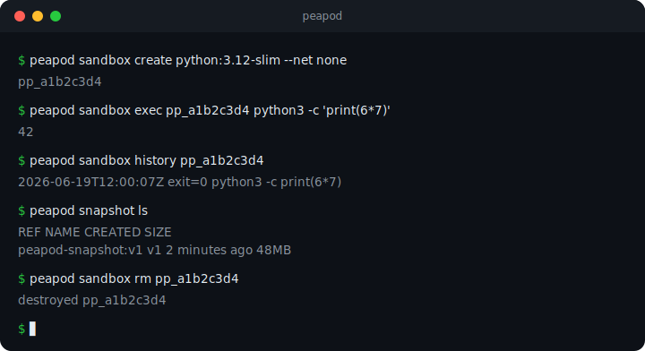

# Peapod — sandboxes isolados e descartáveis para agentes de IA

> **Peapod** dá a cada agente de IA (ou a você) um ambiente Linux **isolado,
> descartável e auditado** para rodar código não-confiável ou gerado por IA.
> É dirigido por **MCP** (Model Context Protocol), **CLI**, **dashboard web** e um
> **app nativo de macOS** — com **rede desligada por padrão**, **allowlist de
> domínios** e **trilha de auditoria** de tudo que rodou. É privacidade e
> **menor privilégio** aplicados ao problema novo de **executar código de IA com
> segurança**.

[](https://github.com/andre28abr/Peapod/actions/workflows/ci.yml)


[](https://github.com/andre28abr/Peapod/releases/latest)



---

## 👤 Autor

**André Augusto Azarias De Souza** — DPO / Encarregado de Dados · Compliance & GRC · Privacy Engineering

Profissional com mais de 18 anos de experiência em **gestão administrativa, compliance, governança da informação e proteção de dados pessoais**, com formação dupla em **Direito (Anhanguera)** e **Análise e Desenvolvimento de Sistemas (Mackenzie)**. Atuou por quase duas décadas como **Gerente Administrativo e Encarregado de Dados (DPO)** em organização do setor de saúde suplementar, com foco em adequação à LGPD, governança documental e interface com áreas técnicas.

Atualmente em **transição de carreira, com disponibilidade imediata**, este projeto Peapod foi conduzido como **product owner técnico, com auxílio de assistentes de IA generativa para a etapa de codificação** — traduzindo princípios de **privacidade, menor privilégio e auditabilidade** (rede desligada por padrão, allowlist de egresso, trilha de auditoria, ambientes efêmeros) para o problema atual de **executar código gerado por IA com segurança**, demonstrando fluência técnica suficiente para dialogar com times de engenharia, segurança e operações.

→ **[Bio completa: AUTHOR.md](AUTHOR.md)** · [LinkedIn](https://linkedin.com/in/andreaugusto-azariasdesouza) · [GitHub Profile](https://github.com/andre28abr)

### 📂 Outros projetos do autor

**[SentinelBR](https://github.com/andre28abr/SentinelBR-platform)** — Plataforma open-source de **SIEM + LGPD** para PMEs brasileiras: agente Go (gRPC mTLS), detecção em tempo real, resposta automatizada e compliance LGPD nativa, multi-tenant.

**[VigiaOS](https://github.com/andre28abr/VigiaOS)** — Suíte de **segurança, privacidade e LGPD** para a *estação de trabalho* (Fedora Workstation, GTK4 + libadwaita): hardening, antivírus, integridade de arquivos e relatórios de conformidade.

**[Plataforma LGPD](https://github.com/andre28abr/lgpd-platform)** — Plataforma web multi-tenant que **treina, avalia e opera** a conformidade com a LGPD (ROPA, RIPD, direitos do titular, resposta a incidentes).

**SC Platform** *(privado, sob NDA — disponível para apresentação em entrevistas mediante solicitação)* — SaaS multi-tenant para gestão de licitações públicas (PNCP, simulador da Lei 14.133, robô de lances, extração de PDF com IA local, CRM). 75k+ linhas, 420 testes.

Onde o SentinelBR cuida do *servidor* e o VigiaOS da *estação de trabalho*, o **Peapod** cuida de um terceiro lugar onde dados sensíveis vão passar cada vez mais: a **execução de código por agentes de IA**.

---

## 🫛 O que é (em uma frase)

Cada **ervilha** é um sandbox isolado; a **vagem** (Peapod) cria e cuida de várias, uma por tarefa. Quando uma IA precisa rodar código, ela faz isso *dentro* de uma ervilha — e no fim a ervilha é descartada, sem deixar resíduo no seu computador.

## 🛡️ Por que — privacidade e menor privilégio

Deixar uma IA rodar código direto na sua máquina é risco: um bug ou uma dependência maliciosa toca seus arquivos, sua rede, suas chaves. O Peapod aplica princípios de *privacy/security by design* a esse problema:

- **Isolado e descartável** — faça bagunça e jogue fora; seu host fica intacto (*minimização*).
- **Rede desligada por padrão** — ou uma **allowlist de domínios** (egresso só para o que você autorizar — *menor privilégio*).
- **Auditado** — todo comando que rodou fica registrado e revisável (*auditabilidade / Art. 37 ROPA-like*).
- **Efêmero** — sem retenção de dados além do necessário.
- **Limites de recurso** — CPU, memória e PIDs por sandbox.

## 💡 Como usar — o jeito certo

O Peapod **não é "mais um Docker"**. O uso mais valioso dele é como **rede de proteção para a IA rodar código** — a ideia é deixar o agente trabalhar *dentro* do Peapod, não no seu Mac.

### Caso principal — guarda-costas dos agentes de IA

Com o `.mcp.json`, o Peapod já aparece como ferramenta no Claude Code (e similares). Sempre que for pedir à IA para executar algo em que você **não confia 100%** — um script de um gist, uma dependência duvidosa, um `curl | bash`, ou código que a própria IA acabou de gerar — peça para rodar **num sandbox do Peapod**:

> *"Tem um script Python nesse link que diz redimensionar imagens, mas não confio. **Roda num sandbox do Peapod** e me diz o que ele faz."*

O agente, sozinho, cria o sandbox (sem rede), executa o código isolado, te devolve a saída, registra cada comando na **trilha de auditoria** e descarta tudo no fim. O seu computador nunca é tocado — e você pode revisar exatamente o que rodou.

### Caso casual — rascunho descartável

"Quero testar uma coisa sem sujar meu Mac." Abra o **app**, escolha um **template** (Python, Postgres, Node…), use a aba **Run** e descarte. No terminal é o mesmo: `sandbox create` → mexer → `sandbox rm`.

### Modelo mental (para quem já conhece contêiner)

Pense no Peapod como **`docker run --rm` com três superpoderes**:

| Superpoder | O que isso te dá |
|---|---|
| 🔒 **Seguro por padrão** | sem rede e com limites de CPU/mem/PID; quando o código precisa de internet (ex.: `pip install`), você libera **só** os domínios necessários com `--allow pypi.org` |
| 🧾 **Com memória** | trilha de auditoria de todos os comandos que rodaram no sandbox |
| 🤖 **Dirigível por IA** | exposto via MCP, o agente cria, roda e descarta sozinho |

A diferença para o Docker cru não é *rodar contêiner* — é o **contexto de segurança, auditoria e IA** em volta.

### Para que **não** serve

Não é para rodar serviços de produção nem substituir o Docker Desktop em apps de longa duração. É para execução **efêmera, isolada e não-confiável** — o "laboratório selado", não o servidor.

## ⬇️ Instalar (macOS)

**[⬇️ Baixar a última versão — Peapod.dmg](https://github.com/andre28abr/Peapod/releases/latest)** · abra o `.dmg` e arraste o **Peapod** para *Aplicativos*.

> Na primeira vez, como o app é assinado *ad-hoc* (não notarizado pela Apple), o macOS exibe um aviso de segurança. Clique com o **botão direito em Peapod → Abrir → Abrir** — depois disso, abre com duplo-clique normalmente.
>
> Requer **OrbStack** (ou Docker) rodando.

## 🚀 Começando (a partir do código)

```sh
# CLI
go build -o bin/peapod ./cmd/peapod

ID=$(bin/peapod sandbox create python:3.12-slim --net none)
bin/peapod sandbox exec "$ID" python3 -c 'print(6*7)'
bin/peapod sandbox history "$ID"     # trilha de auditoria
bin/peapod sandbox rm "$ID"
```

```sh
# App nativo de macOS (gera Peapod.app + Peapod.dmg, com o binário embutido)
cd ui-native && ./build.sh
```

**Agentes de IA (MCP):** o repositório traz um `.mcp.json`; abrir esta pasta no Claude Code carrega o servidor automaticamente, expondo `peapod_sandbox_create`, `peapod_exec`, `peapod_history`, … (12 ferramentas).

> Requer **OrbStack** (ou Docker) rodando para o backend `oci`.

## 🧩 Arquitetura — uma costura, vários backends

Tudo senta sobre um núcleo fino (`Manager`) com uma interface `Driver` trocável; novos backends de isolamento e funcionalidades plugam sem tocar no topo:

```
        servidor MCP  ·  CLI  ·  dashboard web  ·  app nativo macOS
                              │
                       Manager (núcleo)
                              │   interface Driver  ← a costura
        ┌──────────────┬──────┴────────┬──────────────┐
       oci          apple-container   libkrun         mock
   (docker/podman)   (microVM, m26)   (depois)       (testes)
```

Capacidades opcionais (checkpoint, logs, stats, diff de snapshot) são detectadas por *interface assertion* — cada backend implementa só o que suporta.

## 🧰 Funcionalidades

- **Sandboxes**: create / exec / arquivos / ls / destroy, com limites de CPU/mem/PID e timeout de exec.
- **Servidor MCP** (12 ferramentas) para agentes dirigirem tudo.
- **Trilha de auditoria**: cada comando registrado (`sandbox history`).
- **Firewall por domínio**: proxy de allowlist de egresso (`peapod proxy --allow …`).
- **Snapshots**: snapshot / fork / ls / prune / **diff**.
- **Ciclo de vida**: pause / resume, **auto-pause** de ocioso, reap por idade.
- **Templates**: imagens de 1 clique (Python, Node, Go, Postgres…).
- **Multi-serviço**: `up` / `down` / `ps` a partir de um `peapod.json`, com publicação de portas.
- **Preview envs**: um sandbox por branch do git, com o repo montado.
- **UIs**: dashboard web (`peapod ui`) e app nativo de macOS.
- **Experimental**: checkpoint/restore CRIU (onde o engine suportar).

## ⌨️ Comandos

```
peapod sandbox create <image> [--net none|egress] [--ports h:c,…] [--allow d1,d2]
peapod sandbox exec|logs|stats|history|snapshot|pause|resume|rm <id>
peapod snapshot ls | rm <ref> | prune [--max-age 24h] | diff <a> <b>
peapod up | down | ps [-f peapod.json]      # grupos multi-serviço
peapod preview up | status | down           # ambiente por branch
peapod proxy --allow d1,d2                  # allowlist de egresso
peapod reap [--max-age 30m] | pause-idle [--max-idle 15m]
peapod templates | ui | mcp | version
peapod --backend oci|apple|mock <command>
```

## 🔬 Desenvolvimento

```sh
go test ./...     # usa o driver mock em memória — não precisa de daemon
go vet ./...
```

CI (GitHub Actions) roda vet/test/build a cada push. Fórmula Homebrew em `Formula/peapod.rb`.

## 📄 Licença

AGPL-3.0 © André Augusto Azarias De Souza
