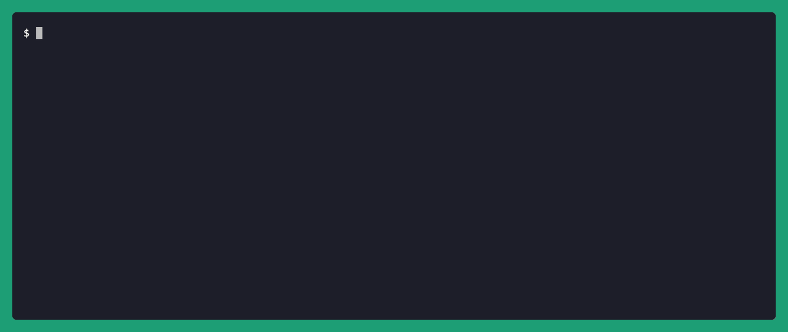

# Peapod — sandboxes isolados e descartáveis para agentes de IA

> **Peapod** dá a cada agente de IA (ou a você) um ambiente Linux **isolado,
> descartável e auditado** para rodar código não-confiável ou gerado por IA.
> É dirigido por **MCP** (Model Context Protocol), **CLI**, **dashboard web** e um
> **app nativo de macOS** — com **rede desligada por padrão**, **allowlist de
> domínios** e **trilha de auditoria** de tudo que rodou. É privacidade e
> **menor privilégio** aplicados ao problema novo de **executar código de IA com
> segurança**.

[](https://github.com/andre28abr/Peapod/actions/workflows/ci.yml)




---

## 👤 Autor

**André Augusto Azarias de Souza** · DPO / Encarregado de Dados · Compliance & GRC · Privacy Engineering

Gestor com **18 anos de atuação como Gerente Administrativo e Encarregado de Dados (DPO)** em organização do setor de saúde suplementar, ambiente regulado pela ANS e pela LGPD. Participou de decisões de diretoria, conduziu a relação com hospitais e operadoras, liderou a modernização dos sistemas administrativos e de segurança da informação e coordenou o programa de adequação à LGPD da organização, com dados sensíveis de saúde sob o Art. 11.

Desde 2025 conduz, como **product owner técnico**, projetos open-source de segurança e privacidade em Python, Go, Rust e Swift, com a codificação orquestrada por assistentes de IA generativa sob sua direção e revisão. O Peapod seguiu esse modelo: traduzindo princípios de **privacidade, menor privilégio e auditabilidade** (rede desligada por padrão, allowlist de egresso, trilha de auditoria, ambientes efêmeros) para o problema atual de **executar código gerado por IA com segurança**. Também desenvolve **automações de processos com n8n** e é autor de cinco livros publicados, entre eles *Da Norma à Liderança*, sobre atualização profissional em GRC.

→ **[Bio completa: AUTHOR.md](AUTHOR.md)** · [LinkedIn](https://linkedin.com/in/andreaugusto-azariasdesouza) · [GitHub Profile](https://github.com/andre28abr)

### 📂 Outros projetos do autor

**[SentinelBR](https://github.com/andre28abr/SentinelBR-platform)**   <br>
Plataforma open-source de **SIEM + LGPD** para PMEs brasileiras: agente Go com gRPC e mTLS, detecção em tempo real, resposta automatizada e compliance LGPD nativa, multi-tenant. 225 testes, CI em 16 jobs.

**[VigiaOS](https://github.com/andre28abr/VigiaOS)**   <br>
Suíte de **segurança, privacidade e LGPD** para a estação de trabalho (Fedora Workstation, GTK4 + libadwaita), com 13 ferramentas defensivas, módulos de detecção e resposta e laboratório educacional. 1460 testes em Python e 28 em Rust.

**[Plataforma LGPD](https://github.com/andre28abr/lgpd-platform)**   <br>
Plataforma web multi-tenant que **treina, avalia e certifica** os setores de uma empresa em LGPD e dá ao DPO as ferramentas de operação: ROPA, RIPD, direitos do titular e incidentes. 121 testes, 95% de cobertura.

**[Uptend](https://github.com/andre28abr/Uptend)**  <br>
App nativo de macOS para **configurar e manter o Mac** e **auditar servidores Linux**: coletor portátil, relatórios, correlação com CVEs, MITRE ATT&CK, lente LGPD e playbook de hardening com rollback. 428 testes, zero warnings.

**[banana](https://github.com/andre28abr/banana-releases)**   <br>
Editor **local-first** de notas Markdown, código e PDF, com vault cifrado (Argon2id + AES-256-GCM). 393 testes.

Todos os projetos, com o porquê de cada um, no perfil [github.com/andre28abr](https://github.com/andre28abr).

---

## Sumário

1. [O que é (em uma frase)](#-o-que-é-em-uma-frase)
2. [Por que — privacidade e menor privilégio](#-por-que--privacidade-e-menor-privilégio)
3. [Como usar — o jeito certo](#-como-usar--o-jeito-certo)
4. [Instalar (macOS)](#-instalar-macos)
5. [Começando (a partir do código)](#-começando-a-partir-do-código)
6. [Arquitetura — uma costura, vários backends](#-arquitetura--uma-costura-vários-backends)
7. [Funcionalidades](#-funcionalidades)
8. [Comandos](#-comandos)
9. [Documentação](#-documentação)
10. [Desenvolvimento](#-desenvolvimento)
11. [Licença](#-licença)

---

## 🫛 O que é (em uma frase)

Cada **ervilha** é um sandbox isolado; a **vagem** (Peapod) cria e cuida de várias, uma por tarefa. Quando uma IA precisa rodar código, ela faz isso *dentro* de uma ervilha — e no fim a ervilha é descartada, sem deixar resíduo no seu computador.

## 🛡️ Por que — privacidade e menor privilégio

Deixar uma IA rodar código direto na sua máquina é risco: um bug ou uma dependência maliciosa toca seus arquivos, sua rede, suas chaves. O Peapod aplica princípios de *privacy/security by design* a esse problema:

- **Isolado e descartável** — faça bagunça e jogue fora; seu host fica intacto (*minimização*).
- **Rede desligada por padrão** — ou uma **allowlist de domínios** (egresso só para o que você autorizar — *menor privilégio*).
- **Auditado** — todo comando que rodou fica registrado e revisável (*auditabilidade / Art. 37 ROPA-like*).
- **Efêmero** — sem retenção de dados além do necessário.
- **Limites de recurso** — CPU, memória e PIDs por sandbox.

## 💡 Como usar — o jeito certo

O Peapod **não é "mais um Docker"**. O uso mais valioso dele é como **rede de proteção para a IA rodar código** — a ideia é deixar o agente trabalhar *dentro* do Peapod, não no seu Mac.

### Caso principal — guarda-costas dos agentes de IA

Com o `.mcp.json`, o Peapod já aparece como ferramenta no Claude Code (e similares). Sempre que for pedir à IA para executar algo em que você **não confia 100%** — um script de um gist, uma dependência duvidosa, um `curl | bash`, ou código que a própria IA acabou de gerar — peça para rodar **num sandbox do Peapod**:

> *"Tem um script Python nesse link que diz redimensionar imagens, mas não confio. **Roda num sandbox do Peapod** e me diz o que ele faz."*

O agente, sozinho, cria o sandbox (sem rede), executa o código isolado, te devolve a saída, registra cada comando na **trilha de auditoria** e descarta tudo no fim. O seu computador nunca é tocado — e você pode revisar exatamente o que rodou.

### Caso casual — rascunho descartável

"Quero testar uma coisa sem sujar meu Mac." Abra o **app**, escolha um **template** (Python, Postgres, Node…), use a aba **Run** e descarte. No terminal é o mesmo: `sandbox create` → mexer → `sandbox rm`.

### Modelo mental (para quem já conhece contêiner)

Pense no Peapod como **`docker run --rm` com três superpoderes**:

| Superpoder | O que isso te dá |
|---|---|
| 🔒 **Seguro por padrão** | sem rede e com limites de CPU/mem/PID; quando o código precisa de internet (ex.: `pip install`), você libera **só** os domínios necessários com `--allow pypi.org` — firewall **à prova de bypass** (rede interna + proxy sidecar) |
| 🧾 **Com memória** | trilha de auditoria de todos os comandos que rodaram no sandbox |
| 🤖 **Dirigível por IA** | exposto via MCP, o agente cria, roda e descarta sozinho |

A diferença para o Docker cru não é *rodar contêiner* — é o **contexto de segurança, auditoria e IA** em volta.

### Para que **não** serve

Não é para rodar serviços de produção nem substituir o Docker Desktop em apps de longa duração. É para execução **efêmera, isolada e não-confiável** — o "laboratório selado", não o servidor.

## ⬇️ Instalar (macOS)

**Pelo Homebrew** (macOS 13+, Apple Silicon):

```sh
brew tap andre28abr/peapod
brew trust andre28abr/peapod   # Homebrew 6+: confiar no tap (uma vez)
brew install --cask peapod     # app de macOS
brew install peapod            # CLI + servidor MCP
```

Sem Homebrew, baixe o [Peapod.dmg](https://github.com/andre28abr/Peapod/releases/latest) e arraste o app para *Aplicativos*. O app é assinado ad-hoc (não notarizado pela Apple): na primeira abertura, clique com o botão direito e escolha **Abrir**. Em Intel, compile a partir do código. Requer **OrbStack** (ou Docker) rodando.

## 🚀 Começando (a partir do código)

```sh
# CLI
go build -o bin/peapod ./cmd/peapod

ID=$(bin/peapod sandbox create python:3.12-slim --net none)
bin/peapod sandbox exec "$ID" python3 -c 'print(6*7)'
bin/peapod sandbox history "$ID"     # trilha de auditoria
bin/peapod sandbox rm "$ID"
```

```sh
# App nativo de macOS (gera Peapod.app + Peapod.dmg, com o binário embutido)
cd ui-native && ./build.sh
```

**Agentes de IA (MCP):** o repositório traz um `.mcp.json`; abrir esta pasta no Claude Code carrega o servidor automaticamente, expondo `peapod_sandbox_create`, `peapod_exec`, `peapod_history`, … (12 ferramentas).

> Requer **OrbStack** (ou Docker) rodando para o backend `oci`.

## 🧩 Arquitetura — uma costura, vários backends

Tudo senta sobre um núcleo fino (`Manager`) com uma interface `Driver` trocável; novos backends de isolamento e funcionalidades plugam sem tocar no topo:

```
        servidor MCP  ·  CLI  ·  dashboard web  ·  app nativo macOS
                              │
                       Manager (núcleo)
                              │   interface Driver  ← a costura
        ┌──────────────┬──────┴────────┬──────────────┐
       oci          apple-container   libkrun         mock
   (docker/podman)   (microVM, m26)   (depois)       (testes)
```

Capacidades opcionais (checkpoint, logs, stats, diff de snapshot) são detectadas por *interface assertion* — cada backend implementa só o que suporta.

## 🧰 Funcionalidades

- **Sandboxes**: create / exec / arquivos / ls / destroy, com limites de CPU/mem/PID e timeout de exec.
- **Servidor MCP** (12 ferramentas) para agentes dirigirem tudo.
- **Trilha de auditoria**: cada comando registrado (`sandbox history`).
- **Firewall por domínio à prova de bypass**: `--allow d1,d2` coloca o sandbox numa rede interna (sem rota pra fora) com um **proxy sidecar** como única saída — até um processo que ignore `HTTP(S)_PROXY` fica sem rota.
- **Snapshots**: snapshot / fork / ls / prune / **diff**.
- **Ciclo de vida**: pause / resume, **auto-pause** de ocioso, reap por idade.
- **Templates**: imagens de 1 clique (Python, Node, Go, Postgres…).
- **Multi-serviço**: `up` / `down` / `ps` a partir de um `peapod.json`, com publicação de portas.
- **Preview envs**: um sandbox por branch do git, com o repo montado.
- **UIs**: dashboard web (`peapod ui`) e app nativo de macOS.
- **Experimental**: checkpoint/restore CRIU (onde o engine suportar).

## ⌨️ Comandos

```
peapod sandbox create <image> [--net none|egress] [--ports h:c,…] [--allow d1,d2]
peapod sandbox exec|logs|stats|history|snapshot|pause|resume|rm <id>
peapod snapshot ls | rm <ref> | prune [--max-age 24h] | diff <a> <b>
peapod up | down | ps [-f peapod.json]      # grupos multi-serviço
peapod preview up | status | down           # ambiente por branch
peapod proxy --allow d1,d2                  # allowlist de egresso
peapod reap [--max-age 30m] | pause-idle [--max-idle 15m]
peapod templates | ui | mcp | version
peapod --backend oci|apple|mock <command>
```

## 📚 Documentação

- **[Guia para todos](docs/GUIA.md)** — o Peapod sem jargão: o que é, por que importa, primeiros passos, receitas e FAQ.
- **[Manual técnico](docs/MANUAL.md)** — arquitetura, backends, modelo de segurança, referência da CLI, as 12 ferramentas MCP, snapshots, preview envs, multi-serviço, variáveis de ambiente.
- **[Site](https://andre28abr.github.io/Peapod/)** — página de apresentação (gerada de `docs/`).
- **[App nativo](ui-native/README.md)** — como compilar `Peapod.app` e `Peapod.dmg`.
- **[AUTHOR.md](AUTHOR.md)** — sobre o autor.

Os dois guias também abrem dentro do app (abas *Para todos* e *Técnico*).

## 🔬 Desenvolvimento

```sh
go test -race ./...                                       # 27 testes; driver mock em memória — não precisa de daemon
go vet ./... && go run honnef.co/go/tools/cmd/staticcheck@latest ./...
cd ui-native && ./build.sh                                # Peapod.app + Peapod.dmg (macOS)
```

O servidor MCP é testado de ponta a ponta pelo protocolo (cliente em memória do SDK oficial): as 12 ferramentas registradas, o ciclo criar → escrever → executar → histórico → destruir, snapshot/fork e erros que chegam ao agente como *tool errors*, nunca como queda de sessão.

CI (GitHub Actions) roda vet, staticcheck, testes com *race detector* e build no Linux, e compila o app SwiftUI no macOS conferindo o alvo mínimo (13.0) a cada push. Tap Homebrew: [andre28abr/homebrew-peapod](https://github.com/andre28abr/homebrew-peapod) (fórmula também versionada em `Formula/peapod.rb`).

## 📄 Licença

AGPL-3.0 © André Augusto Azarias De Souza
