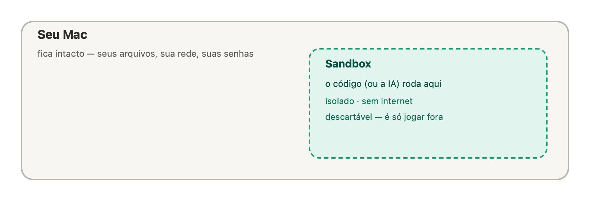
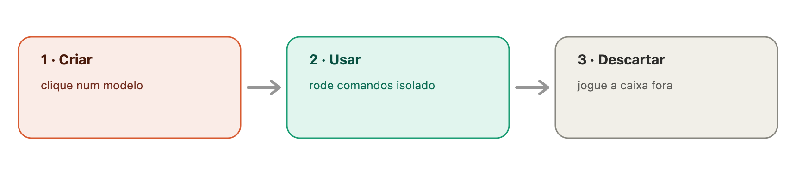

# Guia do Peapod — para todos 🫛

Bem-vindo! Este guia explica o Peapod **sem jargão**. Se você nunca ouviu falar
em "contêiner", tudo bem — começamos do zero. (Quer a parte técnica? Veja a aba
**Técnico**.)

---

## O que é o Peapod, numa imagem

Pense numa **caixa de areia**: a criança faz a bagunça que quiser e, no fim, é só
varrer. O Peapod é isso para programas — uma **caixa fechada e descartável** onde
um código roda **isolado**. Quando você termina, joga a caixa fora e o seu
computador continua intacto.

Cada caixinha dessas a gente chama de **sandbox**. O Peapod cria e cuida de
várias (daí o nome: ervilhas numa vagem 🫛).

## Por que isso é útil

Hoje a inteligência artificial **escreve e executa** código o tempo todo. Rodar
um código que você não conhece direto no seu Mac é arriscado: ele pode mexer nos
seus arquivos, na sua rede ou nas suas senhas.

Com o Peapod, esse código roda **dentro da caixa**. Se for ruim, o estrago fica
preso lá dentro — e você joga a caixa fora.

## Antes de começar (1 minutinho)

O Peapod usa um motor chamado **OrbStack** para criar as caixas. Ele precisa
estar **ligado**.

- Se ao abrir o Peapod aparecer **"O OrbStack não está rodando"**, é só clicar no
  botão **Abrir OrbStack** e esperar uns segundos.

## Primeiros passos (passo a passo)

1. Abra o **Peapod**.
2. Você verá **"Comece com um modelo"** e vários botões: Python, Node, Postgres…
   Um **modelo** é só um ambiente pronto para usar.
3. Clique, por exemplo, em **Python 3.12**.
4. Aparece um **"criando…"** com um rodinha. *Na primeira vez* ele baixa o
   ambiente — é normal levar alguns segundos.
5. Pronto! Seu primeiro **sandbox** aparece na lista. 🎉

No fim, o ciclo é sempre o mesmo:

## O que dá pra fazer com um sandbox

Cada item da lista tem botões:

- **Logs** → abre um painel com três abas:
  - **Executar:** digite um comando (ex.: `python3 -c "print(2+2)"`) e clique
    **Executar** — a saída aparece ali.
  - **Histórico:** mostra **tudo** que já foi rodado dentro daquela caixa.
  - **Logs:** a saída do programa principal da caixa.
  - No topo do painel há também o uso de **CPU e memória** ao vivo.
- **Snapshot** → tira uma "foto" da caixa para clonar depois.
- **Pausar / Retomar** → congela a caixa (economiza recursos) e retoma quando quiser.
- **🗑 (lixeira)** → apaga a caixa.

Para criar **outra** caixa quando já existe uma, use o botão **➕ Novo** no canto
superior.

## Receitas rápidas

- **"Quero testar um script que baixei e não confio."**
  Crie um sandbox, abra **Executar** e rode o script ali dentro. Como a caixa não
  tem internet por padrão, ele não consegue "ligar para fora".
- **"Quero brincar com Python (ou Node) sem instalar nada no Mac."**
  Clique no modelo, abra **Executar**, use à vontade e, no fim, jogue fora.
- **"Quero que a IA rode algo com segurança."**
  No Claude Code, peça: *"rode isso num sandbox do Peapod"*. A IA cria, executa e
  descarta sozinha — e você vê no **Histórico** o que ela fez.

## Imagem personalizada (opcional)

No campo de baixo do painel de criação você pode digitar uma **imagem
específica** (ex.: `python:3.12-bookworm`) em vez de usar um modelo. Se não souber
o que é isso, ignore — os modelos cobrem o dia a dia.

## Perguntas frequentes

- **O sandbox tem internet?** Por padrão, **não** (é mais seguro). Dá para liberar
  só sites específicos quando necessário.
- **Onde ficam meus arquivos?** Dentro da caixa. Quando você a apaga, somem — por
  isso ela é "descartável".
- **É seguro de verdade?** O código fica **isolado** do seu Mac, **sem rede** por
  padrão, com **limites** de uso e um **registro** de tudo que rodou.
- **Apareceu erro do OrbStack.** Clique em **Abrir OrbStack** (ou abra o app
  OrbStack) e tente de novo.
- **Para que NÃO serve?** Não é para hospedar sites/serviços de produção. É para
  testar e executar coisas de forma isolada e temporária.

## Glossário rápido

- **Sandbox:** a caixa isolada e descartável onde o código roda.
- **Modelo:** um ambiente pronto (Python, Node, Postgres…).
- **Imagem:** o "molde" do ambiente.
- **Snapshot:** uma foto da caixa, para clonar depois.
- **OrbStack:** o motor que cria as caixas (precisa estar ligado).

---

Quer entender a arquitetura, a segurança e todos os comandos? Veja a aba
**Técnico**. 🫛
